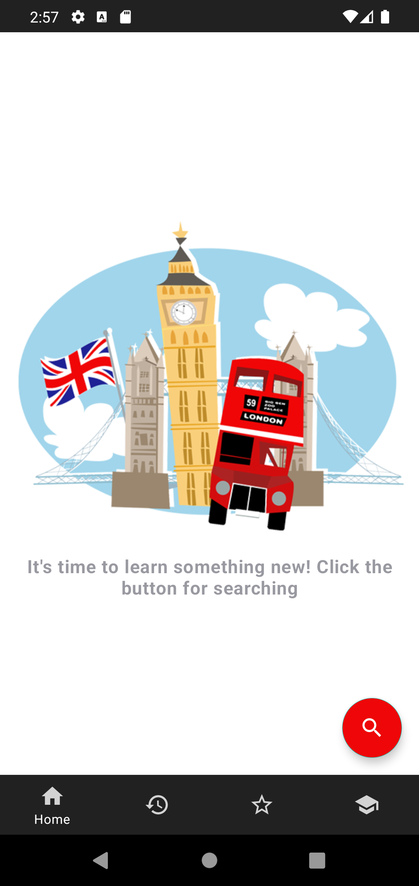
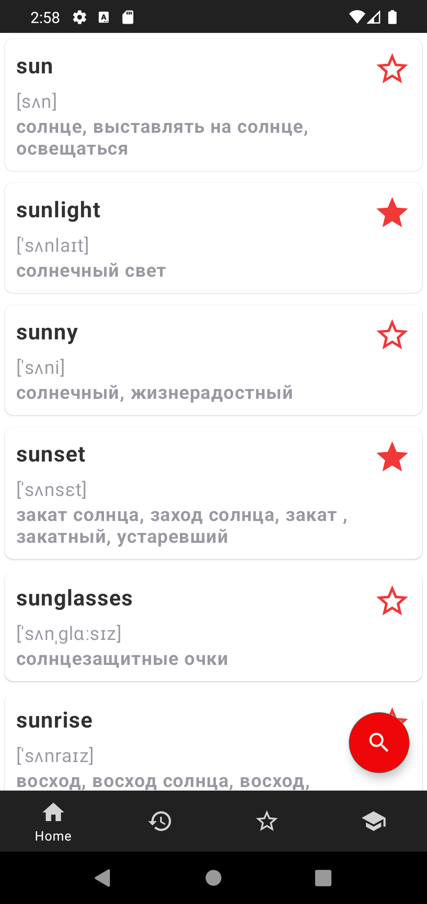
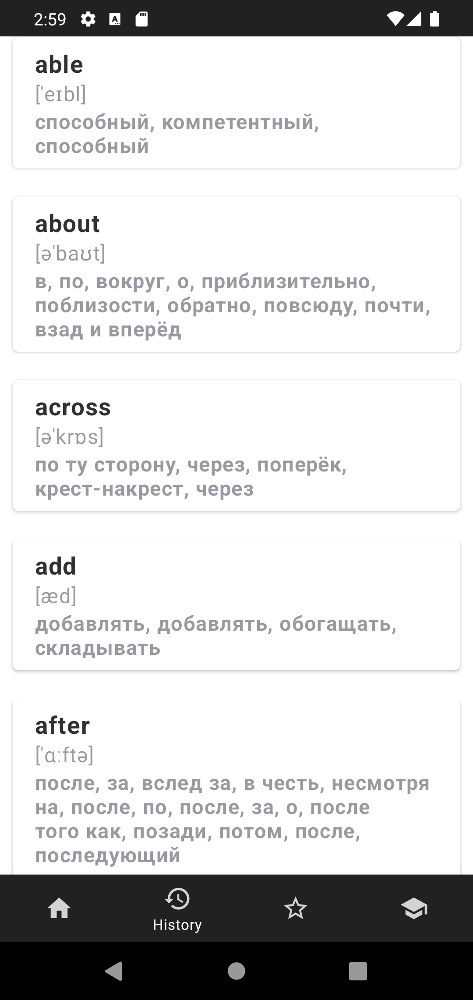
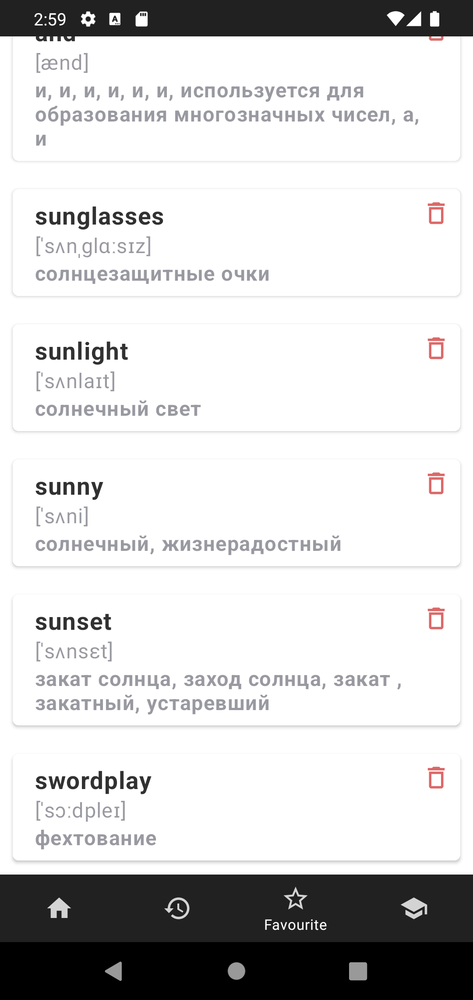
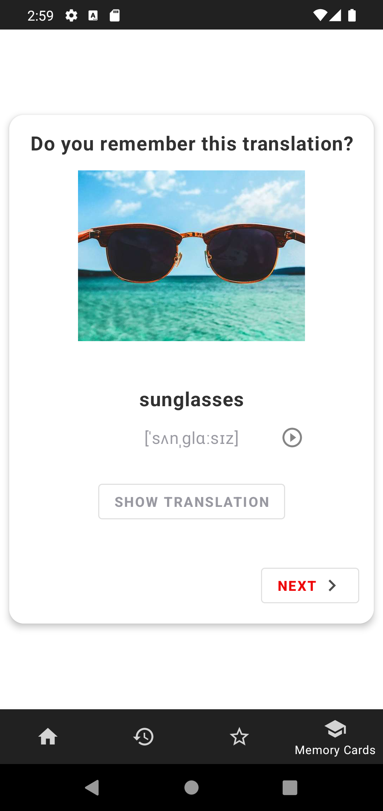

# Open Boarders
 This application is a dictionary. You can translate from Russian language to English and vice versa
 | Main Screen | Result Screen | History Screen | Favourite Screen| Memory Card|
| ------------- | ------------- |------------- |------------- |------------- |
|  | | | | 
 
## Tech stack & Open-source libraries
* Minimum SDK level 23
#### 1. Architecture
* MVVM Architecture
* Modules: App, Core, Model, Repository, Utils
#### 2. Data
* Room
* Retrofit
#### 3. Base Structure
* Single Activity
* Fragments
* Interactors
* Coroutines
#### 4. UI
* Picasso
* ExoPlayer
* ShowCase
#### 5. DI
* Koin
#### 5. Navigation
* Cicerone

________

### Open API
Open Boarders Dictionary using the open source api [Skyeng Dictionary](https://dictionary.skyeng.ru/doc/api/external)
